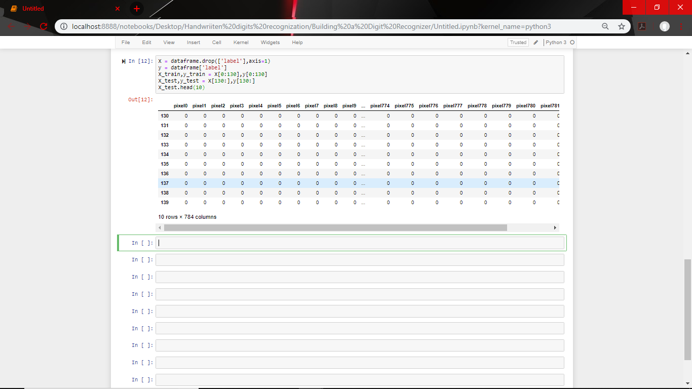
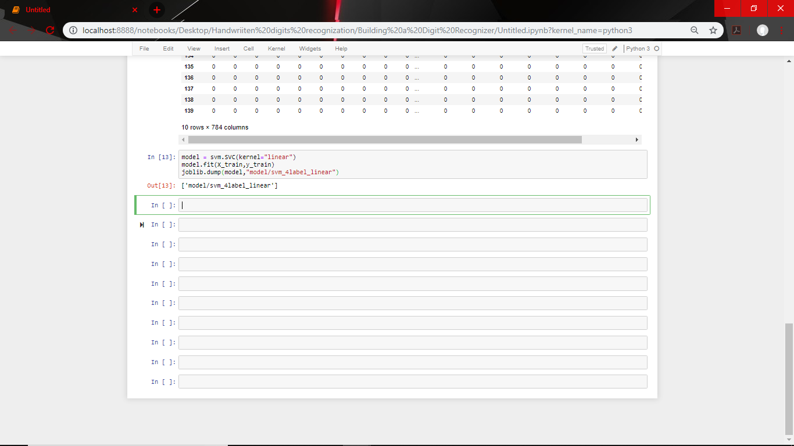

# Handwritten-Digits-Recognition-using-SVM-
This project recognizes the digit pattern using Machine learning algorithm-Support Vector Machine. 

## Problem Statement:
The handwritten digits are not always of the same 
size, width, orientation and justified to margins as they differ from writing of person to person, so the general problem would be while classifying the digits due to the similarity between digits such as 1 and 7, 5 and 6, 3 and 8, 2 and 5, 2 and 7, etc. This problem is faced more when many people write a single digit with a variety of different handwriting. Lastly, the uniqueness and variety in the handwriting of different individuals also influence the formation and appearance of the digits. Now we introduce the concepts and algorithms of deep learning and machine learning.

## Data collection:
Samples provided from MNIST (Modified National Institute of Standards and Technology) data-set includes handwritten digits total of 70,000 images consisting of 60,000 examples in training set and 10,000 examples in testing set, both with labeled images from 06 digits (0 to 5). This is a small segment form the wide set from NIST where size was normalized to fit a 20*20 pixel box and not altering the aspect ratio. Handwritten digits are images in the form of 28*28 gray scale intensities of images representing an image along with the first column to be a label (0 to 5) for every image. The same has opted for the case of the testing set as 10,000 images with a label of 0 to 5.

## Technologies used:
```
Python for scripting
Support Vector Machine for implementing Machine Learning
OpenCV for live prediction 
Joblib for saving the model 
```

## Output:
```
 1 . Import the dataset
 2 . Plot of features 
 ```

 ```
 3 . Separate labels and features
 ```
 
 ```
 4 . Build a model and save it 
 ```
 
 ```
 5 . Print Accuracy
 ```
 
 
 ## Live predictor using OpenCV:
 
 <p align="center">
 
</p>

## Result:
Accuracy of the model 

